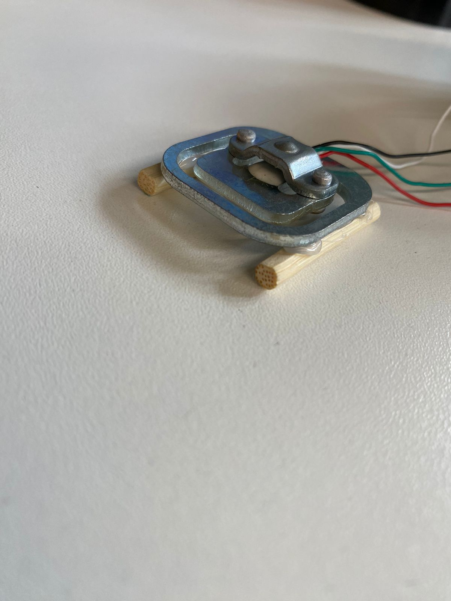
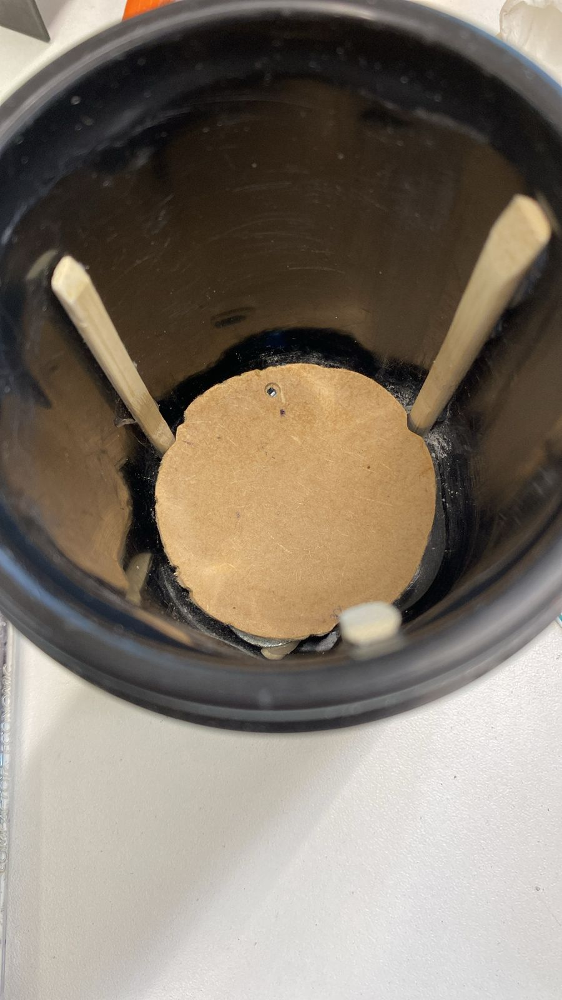
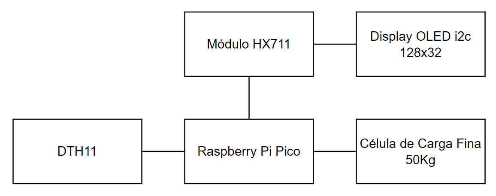
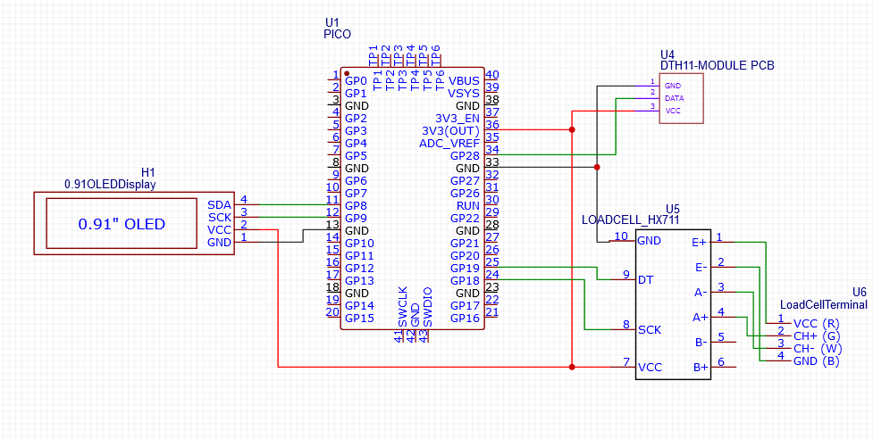

# Project_Smart_Holder
Repositório para o projeto referente a matéria EEN251 do IMT, sobre supervisão dos professores Sergio Ribeiro Augusto e Rodrigo França.

# Sumário

- [Descrição](#Descrição)
- [Requisitos](#Requisitos)
- [Materiais utilizados](#Materiais-utilizados)
- [Custos Estimado](#Custos-Estimado)
- [Funcionamento](#Funcionamento)
- [Diagrama de blocos do sistema](#Diagrama-de-blocos-do-sistema)
- [Esquema Elétrico](#Esquema-Elétrico)
- [Autores](#Autores)
# Descrição 

O projeto consiste em um recipiente inteligente para garrafas, a qual por meio de display e leds o cliente e o garçom podera saber se a garrafa esta vazia ou cheia e se esta fria ou quente, sabendo destes dois dados o garçom poderá atender de forma personalizada e mais rapida o cliente gerando mais conforto para o mesmo.

# Requisitos 

O projeto deve apartir do peso da garrafa colocada saber se ela esta vazia ou cheia indicando atraves de leds essa informaçao, deve apresentar no display a temperatura que a bebida está, deve ter uma fonte de alimentação seja por meio da fonte ou opcionalmente por meio da bateria. 

| ID    |                        Requisito                    |     Tipo     |
| :-----|-----------------------------------------------------|-------------:|
| UR-01 | Medir a temperatura externa da garrafa              | Obrigatório  |
| UR-02 | Medir o peso da garrafa                             | Obrigatório  |
| UR-03 | Mostrar a temperatura no display                    | Obrigatório  |
| UR-04 | Leds devem ascender de acordo com o peso da garrafa | Obrigatório  |
| UR-05 | Tem que ter uma fonte de energia para alimentação   | Obrigatório  |
| UR-06 | Uso de bateria para alimentação                     |**Desejável** |

# Materiais utilizados

- Porta garrafa
- 1 Sensor Temperatura e Umidade DTH11 
- 1 Display OLED i2c OLED 128x32 Px 
- 1 Raspberry Pi Pico
- 1 Módulo HX711
- 1 Célula de Carga Fina 50 Kg
- 3 Leds(vermelho, amarelo, verde)
- Jumpers

# Custo Estimado 

| Item              |   Preço   | 
| :-----------------|----------:|
| DTH11             | R$8,90    |
| OLED i2c          | R$10,97   |
| Raspberry Pi Pico | R$33,90   |
| HX711             | R$5,90    |
| Célula de carga   | R$7,90    |
| Leds x 3          | R$0,72    |
| Porta garrafa     | R$18,49   |
| **Total**         |**R$86,78**|

# Funcionamento

## Teste do sistema não acoplado

## Teste dos ajustes da parte física
Apoio para a celular do sensor de peso

Base e adaptações na garrafa internamente para separar a garrafa dos sensores

## Projeto em funcionamento

## Diagrama de blocos do sistema

## Esquema Elétrico

# Autores
- [Ryuske Hideaki Sato](https://github.com/Dragonrhs)
- [Gabriel Henrique Baca Rado](https://github.com/Gabriel-HBR)
- [Vinícius de Oliveira Berti](https://github.com/ViniciusBerti)
- [Erick Eiji Nagao](https://github.com/ErickNagao)